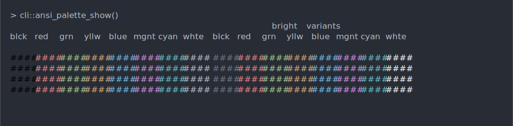

<!-- README.md is generated from README.Rmd. Please edit that file -->

# Using ascii casts in GitHub README files

GitHub READMEs do not allow custom JavaScript code, so we cannot use
HTML widgets in them. But they do allow SVG images, which can also be
animated. This is file is an example README. See the source Rmd file.

First we need to initialize the asciicast engine, as usual:

    ```{r echo = FALSE, results = "hide"}
    asciicast::init_knitr_engine()
    ```

Next we need to set an option to use SVG files instead of the asciinema
player HTML widget.

    ```{r, include = FALSE}
    options(asciicast_knitr_svg = TRUE)
    ```

Now we are ready to include casts. The current default is to create a
snapshot of the screen after the code has run, and to change it, we need
to set the `at` option to `NULL`. (The default is `"end"`.) We also set
`end_wait` to wait three second before restarting the animation. By
default asciicast creates animated SVG files:

    ```{asciicast, cache = TRUE, R.options = list(asciicast_at = NULL)}
    #' Rows: 10
    #' End_wait: 3
    # This is an asciicast example
    loadedNamespaces()
    ```


## Still screenshots

To include a snapshot instead of an animation, the `at` option must be
set to `"end"`, but that is the default currently:

    ```{asciicast, cache = TRUE}
    # This is an asciicast example
    loadedNamespaces()
    ```


## ANSI colors

asciicast supports 256 ANSI colors, but with earlier versions of the
cranyon and/or cli package, you might need to tutn on ANSI color support
manually:

    ```{asciicast, include = FALSE}
    options(cli.num_colors = 256)
    ```

    ```{asciicast, cache = TRUE}
    cli::ansi_palette_show()
    ```


